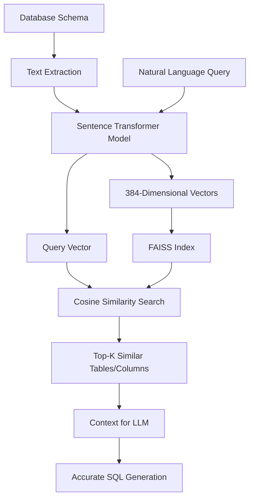

# AI Insight - Vector-Powered Natural Language Database Query Interface

AI Insight is a cutting-edge FastAPI application that revolutionizes database querying through **advanced vector embeddings** and semantic search. It seamlessly combines Large Language Models (LLMs) with **Retrieval Augmented Generation (RAG)** and **FAISS vector indexing** to intelligently understand database schemas and generate accurate SQL queries from natural language.

## 🌟 Key Features

### 🔬 **Advanced Vector Embeddings & Semantic Search**
- **🧠 FAISS Vector Database**: High-performance similarity search using Facebook AI Similarity Search
- **📊 Schema Vectorization**: Automatic conversion of database schemas into semantic embeddings
- **🎯 Intelligent Context Retrieval**: AI-powered discovery of relevant tables and columns using cosine similarity
- **📈 Vector Similarity Heatmaps**: Visual representation of table relationships and semantic connections
- **🔍 Semantic Query Matching**: Natural language queries matched to database elements via vector similarity

### 🤖 **AI-Powered Query Generation**
- **� Natural Language to SQL**: Convert complex English questions into optimized SQL queries
- **🎨 Multi-LLM Support**: Seamless integration with OpenAI, Anthropic Claude, Azure OpenAI, and local models
- **⚡ RAG-Enhanced Context**: Vector-retrieved schema context for more accurate query generation
- **🧩 Adaptive Prompting**: Dynamic prompt construction based on vector similarity scores

### 🏗️ **Production-Ready Architecture**
- **🚀 FastAPI Backend**: High-performance REST API with automatic OpenAPI documentation
- **🎨 Interactive Streamlit Frontend**: Real-time query interface with vector diagnostics
- **📊 SQLite Integration**: Optimized for fast queries and easy deployment
- **🔧 Comprehensive Diagnostics**: Built-in vector relationship analysis and LLM configuration validation

## 🏗️ Project Structure

```
├── app/                    # Main application package
│   ├── main.py             # FastAPI entry point
│   ├── router.py           # API route definitions
│   ├── models.py           # Pydantic request/response schemas
│   ├── llm_client.py       # LLM client for query generation
│   ├── sqlite_client.py    # SQLite operations
│   ├── rag_retriever.py    # 🔬 RAG & Vector Search Engine
│   ├── prompts.py          # Jinja2 templates for prompt generation
│   ├── config.py           # Configuration management
│   └── utils.py            # Utility functions
├── app_ui/                 # Frontend interface
│   └── streamlit_app.py    # Streamlit web interface with vector diagnostics
├── retriever/              # 🧠 Vector Embeddings & FAISS Engine
│   ├── build_index.py      # 🏗️ FAISS Vector Index Builder
│   ├── query_index.py      # 🔍 Vector Similarity Search
│   ├── faiss_index/        # 📊 FAISS Vector Database (auto-generated)
│   │   ├── schema.index    # 🗂️ High-dimensional vector embeddings
│   │   └── table_names.pkl # 📋 Schema-to-vector mapping metadata
│   ├── retriever/          # Nested retriever module for staging
│   │   └── faiss_index/    # 🔄 Alternative vector index location
│   ├── README.md           # Vector system documentation
│   └── __init__.py         # Python package initialization
├── check.py                # 🔍 Vector Diagnostics & LLM Config Analyzer
├── .env                    # Environment variables (git-ignored)
├── .env.example            # Environment variable template
├── .gitignore              # Git ignore rules (excludes vector indices)
├── ENV_SETUP.md            # Environment setup guide
├── README.md               # This comprehensive guide
├── requirements.txt        # Python dependencies (includes FAISS, sentence-transformers)
├── start.bat               # Windows startup script with vector validation
└── start.sh                # Unix/Linux startup script with vector validation
```

### 🔬 **Vector System Components**

- **📊 FAISS Index**: High-performance vector similarity search
- **🧮 Sentence Transformers**: State-of-the-art text embeddings (all-MiniLM-L6-v2)
- **🎯 Cosine Similarity**: Mathematical similarity scoring between queries and schema elements
- **📈 Vector Diagnostics**: Built-in analysis tools for vector relationships and performance
- **🔄 Auto-Indexing**: Automatic vector index generation from database schemas

**Notes**: 
- Database files (`*.db`) are excluded from version control via `.gitignore`
- Virtual environment folders (`.venv/`, `Lib/`, `Scripts/`) are excluded from version control
- Sample database files may exist for development but should not be committed to production repos
- FAISS index files are auto-generated when the application first runs

## Installation

1. **Clone the repository**
   ```bash
   git clone <repository-url>
   cd Ai-Insight
   ```

2. **Create a virtual environment**
   ```bash
   python -m venv .venv
   
   # On Windows
   .venv\Scripts\activate
   
   # On macOS/Linux
   source .venv/bin/activate
   ```

3. **Install dependencies**
   ```bash
   pip install -r requirements.txt
   ```

4. **Set up environment variables**
   Copy the example environment file and configure it:
   ```bash
   cp .env.example .env
   ```
   
   Edit `.env` with your configuration:
   ```env
   # LLM Configuration
   LLM_API_KEY=your_openai_api_key_here
   LLM_BASE_URL=https://api.openai.com/v1
   LLM_MODEL=gpt-3.5-turbo

   # Database Configuration
   DATABASE_PATH=your_database.db        # SQLite database

   # Application Configuration
   HOST=0.0.0.0
   PORT=8000
   DEBUG=True
   FASTAPI_URL=http://localhost:8001/ask

   # Vector Store Configuration (Critical for AI Features)
   VECTOR_STORE_PATH=retriever/faiss_index    # FAISS vector database location
   EMBEDDING_MODEL=all-MiniLM-L6-v2           # Sentence transformer model for embeddings
   TOP_K_RETRIEVAL=5                          # Number of similar vectors to retrieve
   ```

5. **Set up your database** (Required)
   
   ⚠️ **Important**: You MUST provide a database before the application can work.
   
   **Option A: Use your own SQLite database**
   ```bash
   # Place your .db file in the project root
   cp /path/to/your/database.db ./my_database.db
   
   # Update .env file
   DATABASE_PATH=my_database.db
   ```
   
   **Option B: Create a sample database (Quick Start)**
   ```bash
   # One-line command to create a test database
   sqlite3 sample.db "CREATE TABLE customers (id INTEGER PRIMARY KEY, name TEXT, email TEXT); CREATE TABLE orders (id INTEGER PRIMARY KEY, customer_id INTEGER, amount REAL); INSERT INTO customers VALUES (1, 'John Doe', 'john@example.com'), (2, 'Jane Smith', 'jane@example.com'); INSERT INTO orders VALUES (1, 1, 100.50), (2, 2, 250.75), (3, 1, 75.25);"
   
   # Update .env file
   DATABASE_PATH=sample.db
   ```
   
   **Option C: Create using Python script**
   ```python
   # Run this to create a more detailed test database
   python -c "
   import sqlite3
   conn = sqlite3.connect('sample.db')
   cursor = conn.cursor()
   cursor.execute('CREATE TABLE customers (id INTEGER PRIMARY KEY, name TEXT, email TEXT)')
   cursor.execute('CREATE TABLE orders (id INTEGER PRIMARY KEY, customer_id INTEGER, amount REAL)')
   cursor.execute('INSERT INTO customers VALUES (1, \"John Doe\", \"john@example.com\")')
   cursor.execute('INSERT INTO orders VALUES (1, 1, 100.50)')
   conn.commit()
   conn.close()
   print('✅ Sample database created: sample.db')
   "
   
   # Update .env file
   DATABASE_PATH=sample.db
   ```

6. **🔬 Build the Vector Index** (Essential for AI-Powered Features)
   
   **This step is CRITICAL** - the vector index enables semantic understanding of your database:
   ```bash
   # Build the FAISS vector index from your database schema
   python retriever/build_index.py
   ```
   
   **What this does:**
   - 🧠 **Analyzes Database Schema**: Extracts table and column information
   - 🔬 **Creates Vector Embeddings**: Converts schema elements into high-dimensional vectors using sentence-transformers
   - 📊 **Builds FAISS Index**: Stores vectors in optimized similarity search structure
   - 🎯 **Enables Semantic Search**: Allows natural language queries to find relevant database elements
   - 📈 **Generates Similarity Maps**: Creates relationship mappings between database components
   
   **Vector Index Files Created:**
   ```
   retriever/faiss_index/
   ├── schema.index          # 384-dimensional FAISS vector index
   └── table_names.pkl       # Schema metadata and mappings
   ```

7. **🔍 Verify Vector Setup** (Recommended)
   
   Run the comprehensive diagnostics to ensure everything is working:
   ```bash
   python check.py
   ```
   
   This will display:
   - **🤖 LLM Configuration**: API keys, endpoints, model settings
   - **📊 Vector Database Stats**: Number of vectors, dimensions, similarity matrix
   - **🌡️ Similarity Heatmap**: Visual representation of table relationships
   - **🎯 Query Tests**: Sample natural language to vector matching

## Usage

### Quick Start

**⚠️ Prerequisites: Database + Vector Index Required**

For Windows users:
```bash
# 1. Set up database first (see installation step 5-6 above)
# 2. Then start the application
start.bat
```

For Unix/Linux/macOS users:
```bash
# 1. Set up database first (see installation step 5-6 above)
# 2. Then start the application
chmod +x start.sh
./start.sh
```

### Manual Start (Step-by-Step)

**Prerequisites Check:**
```bash
# 1. Verify database exists
ls -la *.db  # Should show your database file

# 2. Verify vector index exists  
ls -la retriever/faiss_index/  # Should show schema.index and table_names.pkl

# If vector index missing, build it:
python retriever/build_index.py
```

#### Starting the Backend Server

```bash
# Activate virtual environment first
source .venv/bin/activate  # Unix/Linux/macOS
# or
.venv\Scripts\activate  # Windows

# Run the FastAPI server
python run_server.py
```

#### Starting the Frontend

```bash
# In a new terminal (with virtual environment activated)
streamlit run app_ui/streamlit_app.py --server.port 8501
```

The application will be available at:
- **Frontend (Streamlit)**: `http://localhost:8501`
- **Backend API**: `http://localhost:8001`
- **API docs**: `http://localhost:8001/docs`

### API Documentation

Once the server is running, visit:
- **Interactive API docs**: `http://localhost:8001/docs`
- **ReDoc documentation**: `http://localhost:8001/redoc`

### Making Queries

#### Using the Web Interface:
Visit `http://localhost:8501` for the Streamlit web interface with visualizations and interactive querying.

#### Using the `/ask` endpoint:

```bash
curl -X POST "http://localhost:8001/ask" \
     -H "Content-Type: application/json" \
     -d '{"question": "How many customers do we have?"}'
```

#### Example Response:

```json
{
  "question": "How many customers do we have?",
  "sql_query": "SELECT COUNT(*) as total_customers FROM customers",
  "results": [{"total_customers": 150}],
  "success": true,
  "execution_time": 0.05
}
```

### Other Endpoints

- **Health Check**: `GET /health`
- **Database Schema**: `GET /schema`

## Configuration

The application can be configured using environment variables or a `.env` file:

| Variable | Default | Description |
|----------|---------|-------------|
| `LLM_API_KEY` | Required | Your LLM provider API key |
| `LLM_BASE_URL` | `https://api.openai.com/v1` | LLM API base URL |
| `LLM_MODEL` | `gpt-3.5-turbo` | LLM model to use |
| `DATABASE_PATH` | `sakila.db` | Path to SQLite database file |
| `VECTOR_STORE_PATH` | `retriever/faiss_index` | Directory for FAISS index files |
| `TOP_K_RETRIEVAL` | `5` | Number of relevant items to retrieve |
| `MAX_TOKENS` | `500` | Maximum tokens for LLM responses |
| `TEMPERATURE` | `0.1` | LLM temperature for query generation |

## How It Works

1. **Question Processing**: User submits a natural language question
2. **Context Retrieval**: RAG system finds relevant tables and columns using embeddings
3. **Prompt Generation**: Jinja2 templates create structured prompts with database context
4. **SQL Generation**: LLM generates SQL query based on the prompt
5. **Query Execution**: SQLite executes the generated SQL query
6. **Response**: Results are returned with the original question and generated SQL

## Database Setup

### Using SQLite

1. **Prepare your SQLite database**:
   ```bash
   # Place your .db file in the project root, or
   # Update DATABASE_PATH in .env to point to your database
   DATABASE_PATH=/path/to/your/database.db
   ```

2. **Example SQLite database creation**:
   ```python
   import sqlite3
   
   # Create a sample database
   conn = sqlite3.connect('my_database.db')
   cursor = conn.cursor()
   
   # Create a table
   cursor.execute('''
   CREATE TABLE customers (
       id INTEGER PRIMARY KEY,
       name TEXT NOT NULL,
       email TEXT UNIQUE,
       city TEXT
   )
   ''')
   
   # Insert sample data
   cursor.execute("INSERT INTO customers (name, email, city) VALUES (?, ?, ?)",
                  ("John Doe", "john@example.com", "New York"))
   
   conn.commit()
   conn.close()
   ```

## Development

### Running Tests

```bash
pytest
```

### Code Formatting

```bash
black app/
flake8 app/
```

### Adding New Features

1. **New Endpoints**: Add routes in `app/routes.py`
2. **Data Models**: Define Pydantic models in `app/models.py`
3. **LLM Prompts**: Create templates in `app/prompts.py`
4. **Configuration**: Add settings to `app/config.py`

## Troubleshooting

### Common Issues

1. **"No database found" Error**
   ```
   FileNotFoundError: [Errno 2] No such file or directory: 'sakila.db'
   ```
   **Solution:**
   - You MUST provide a database file before starting the application
   - Follow installation step 5 to set up your database
   - Update `DATABASE_PATH` in `.env` to point to your database file

2. **"Vector index not found" Error**
   ```
   FileNotFoundError: retriever/faiss_index/schema.index
   ```
   **Solution:**
   ```bash
   # Build the vector index from your database
   python retriever/build_index.py
   ```

3. **"No tables found in database" Error**
   ```
   ❌ No tables found in database!
   ```
   **Solution:**
   - Ensure your database actually contains tables with data
   - Check database file isn't corrupted: `sqlite3 your_database.db ".tables"`
   - Verify database path is correct in `.env` file

4. **LLM API Key Error**
   - Ensure `LLM_API_KEY` is set correctly in your `.env` file
   - Check API key permissions and billing for your LLM provider

5. **Database Not Found**
   - Verify `DATABASE_PATH` points to a valid SQLite database file
   - Check file permissions and ensure the database file exists

6. **Vector Index Issues**
   - Delete the `retriever/faiss_index` directory to rebuild the index
   - Ensure database has tables with data
   - Check that the database schema can be read

7. **Import Errors**
   - Reinstall dependencies: `pip install -r requirements.txt`
   - Check Python version compatibility (3.8+)
   - Ensure virtual environment is activated

8. **Streamlit Frontend Issues**
   - Check that FastAPI backend is running on port 8001
   - Verify `FASTAPI_URL` in environment variables
   - Ensure both services can communicate

### Logs and Debugging

Set `DEBUG=True` in your environment to enable detailed logging.

## Contributing

1. Fork the repository
2. Create a feature branch
3. Make your changes
4. Add tests if applicable
5. Submit a pull request

## License

This project is licensed under the MIT License - see the LICENSE file for details.

## Acknowledgments

- Built with [FastAPI](https://fastapi.tiangolo.com/) and [Streamlit](https://streamlit.io/)
- Configurable LLM providers: [OpenAI](https://openai.com/), [Azure OpenAI](https://azure.microsoft.com/en-us/products/cognitive-services/openai-service), [Anthropic](https://www.anthropic.com/), and more
- Database support: [SQLite](https://www.sqlite.org/)
- Vector search with [FAISS](https://github.com/facebookresearch/faiss)
- Embeddings from [Sentence Transformers](https://www.sbert.net/)

## 🔬 Vector Embeddings & Semantic Search Deep Dive

### 🧠 How Vector Search Works

AI Insight uses **FAISS (Facebook AI Similarity Search)** with **sentence-transformers** to create a semantic understanding of your database schema:



### 📊 Vector Index Specifications

- **🎯 Model**: `all-MiniLM-L6-v2` (384-dimensional embeddings)
- **📐 Vector Space**: High-dimensional semantic representation
- **🔍 Search Algorithm**: FAISS L2/Cosine similarity
- **⚡ Performance**: Sub-millisecond similarity search
- **🎨 Scalability**: Handles thousands of database elements efficiently

### 🌡️ Vector Similarity Analysis

The system provides comprehensive vector relationship analysis:

```bash
# Run vector diagnostics
python check.py
```

**Sample Output:**
```
🔍 VECTOR RELATION MAP ANALYZER
==================================================
📊 Database: sakila.db
🧠 Embedding Model: all-MiniLM-L6-v2  
📁 Vector Store: retriever/faiss_index

🔗 TABLE RELATIONSHIPS (Cosine Similarity)
---------------------------------------------
1. country ↔ city (similarity: 0.8645)
2. actor ↔ film_actor (similarity: 0.8455)
3. payment ↔ rental (similarity: 0.8274)

🌡️ SIMILARITY HEATMAP
-------------------------
     1  2  3  4  5  6
1. ██ ░░ ▓▓ ▒▒ ░░ ··  country
2. ░░ ██ ▓▓ ▒▒ ░░ ··  city  
3. ▓▓ ▓▓ ██ ▒▒ ░░ ··  address
```

### 🎯 Query-to-Vector Matching Process

1. **🔤 Text Processing**: Natural language query → cleaned text
2. **🧮 Vectorization**: Text → 384-dimensional embedding vector
3. **🔍 Similarity Search**: Query vector vs. schema vectors (cosine similarity)
4. **📊 Ranking**: Top-K most similar database elements
5. **🎨 Context Assembly**: Relevant schema context for LLM
6. **🤖 SQL Generation**: Context-aware SQL query generation

### 🚀 Staging & Production Considerations

#### 🔧 Vector Index Management
- **Development**: Index stored in `retriever/faiss_index/`
- **Staging**: Alternative location at `retriever/retriever/faiss_index/`
- **Production**: Configurable via `VECTOR_STORE_PATH` environment variable

#### 📈 Performance Optimizations
- **Index Persistence**: Pre-built indices for faster startup
- **Batch Processing**: Efficient vectorization of large schemas
- **Memory Management**: Optimized FAISS index loading
- **Caching**: Vector similarity results caching for repeated queries

#### 🛡️ Security & Compliance
- **No Data Leakage**: Only schema metadata is vectorized, not actual data
- **Privacy-First**: Embeddings represent structure, not content
- **Audit Trail**: Vector operations logged for compliance
- **Encryption**: Vector indices can be encrypted at rest
